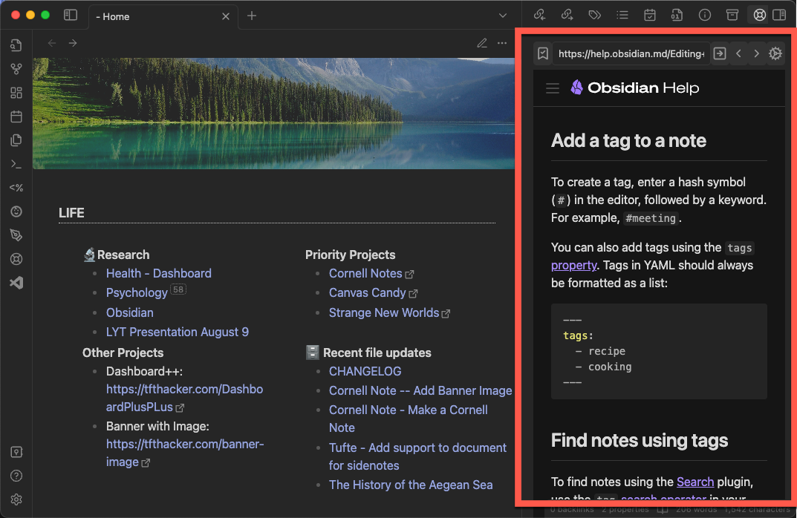

# HelpMate

A plugin that adds a sidepane to Obsidian to view help sites for the plugins and themes you have installed.

# More Information

https://tfthacker.com/HelpMate

# Use of Internet

This plugin is an embedded web browser. It will connect to the internet to retrieve the help sites for the plugins and themes you have installed. It will not connect to the internet for any other reason. It requires a live internet connection to function.
